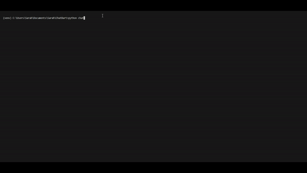

# ChatBart :alien:

# Phase 1: Basic Chat Functionality and API Setup
- [ ] Task 1: Refactor existing basic chat functionality into a modular structure that can be easily converted into an API endpoint.
- [ ] Task 2: Set up a Flask application and create an API endpoint that handles incoming messages and responds using the existing chat logic.
- [ ] Task 3: Test the API endpoint using tools like Postman to ensure it receives and sends messages correctly.
# Phase 2: User Interface Development
- [ ] Task 4: Choose front-end framework for your user interface.
- [ ] Task 5: Design the basic layout of the chat window,and input field.
- [ ] Task 6: Implement the UI components to display messages and user input within the chat window.
- [ ] Task 7: Integrate the API endpoint to talk to our bot and display chat messages.
# Phase 3: Additional UI Features (possibly)
- [ ] Task 8: Implement text-to-speech functionality, allowing the user to hear the chat bot's responses.
- [ ] Task 9: Integrate speech-to-text capability, enabling users to input messages by speaking.
- [ ] Task 10: Design and implement a customization feature for users to choose a custom avatar or pet as the face of the chat bot.
- [ ] Task 11: Provide options for users to select different voices for text-to-speech responses.
# Phase 4: Enhancing Chat Interactions
- [ ] Task 12: Implement context awareness, allowing the chat bot to maintain relevant conversations over multiple messages.
- [ ] Task 13: Develop a system to handle user preferences and store conversation history for a more personalized experience.
# Phase 5: Testing and Optimization
- [ ] Task 14: Conduct thorough testing of the entire application, including the chat bot's AI responses, UI features, and API interactions.
- [ ] Task 15: Optimize the application for performance, responsiveness, and resource efficiency.
- [ ] Task 16: Test the text-to-speech and speech-to-text features on different browsers and devices to ensure compatibility.
# Phase 6: Documentation and Deployment
- [ ] Task 17: Create comprehensive documentation for setting up the project, running the application, and utilizing various features.
- [ ] Task 18: Deploy the application to a chosen hosting environment and ensure it's accessible to end users.

